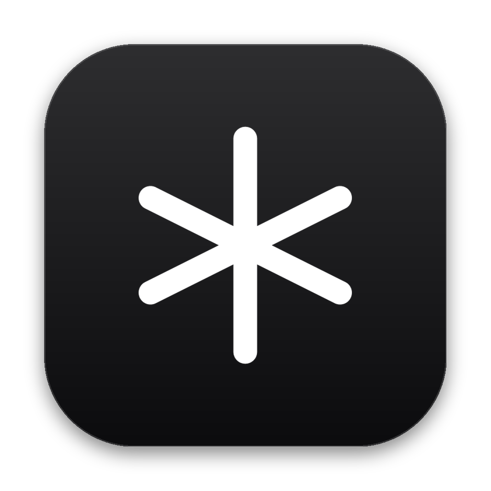
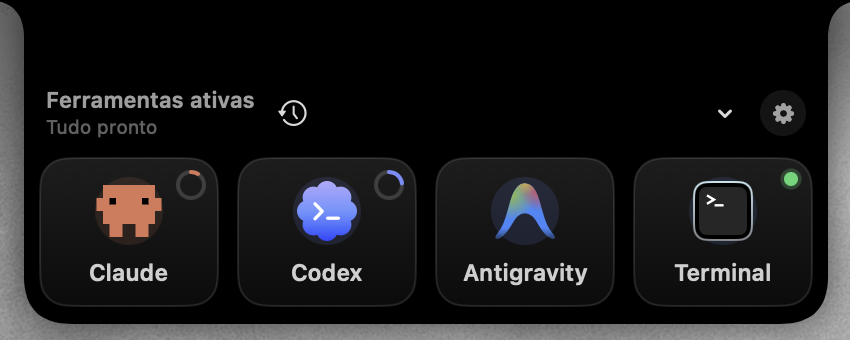
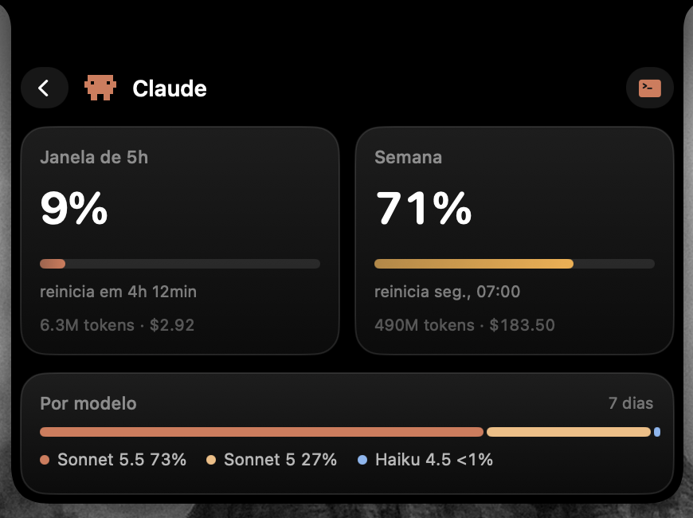
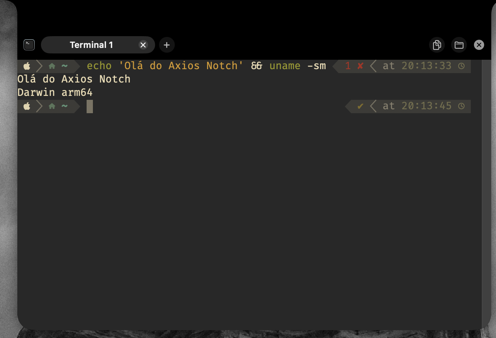
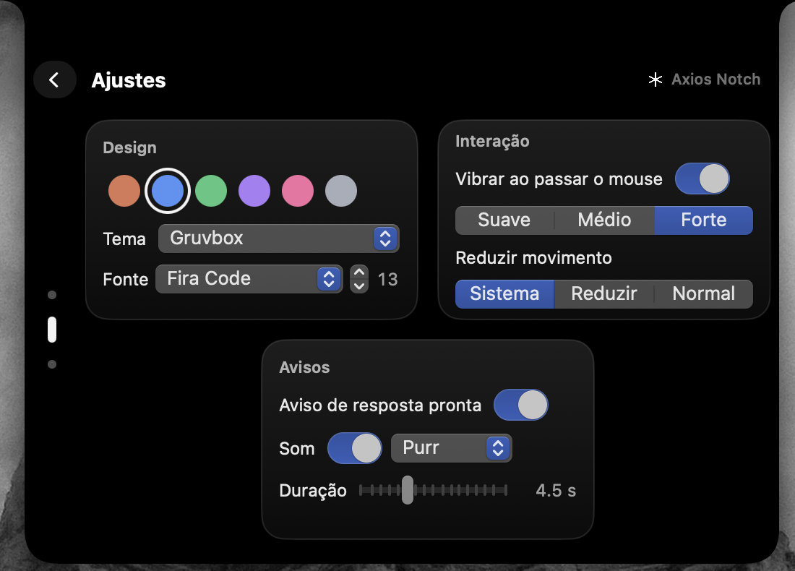

<p align="center">
  
</p>

<h1 align="center">Axios Notch</h1>

<p align="center">
  <b>O notch do seu MacBook, agora um painel para os seus agentes de código.</b><br>
  Uso do plano de Claude e Codex, terminais e avisos de resposta, a um clique.
</p>

<p align="center">
  
  
  
  
  
</p>

<p align="center">
  <a href="https://github.com/YuriTals/axios-notch/releases/latest"><b>⬇ Baixar o .dmg</b></a> ·
  <a href="#o-que-ele-faz">Recursos</a> ·
  <a href="#instalar">Instalar</a> ·
  <a href="#o-que-o-app-lê-e-para-onde-envia">Privacidade</a> ·
  <a href="#compilar">Compilar</a>
</p>

<p align="center">
  
  
</p>
<p align="center">
  
  
</p>

> Requer macOS 14 ou superior, em Mac com Apple Silicon (a versão publicada é arm64; Macs Intel precisam compilar). O app não tem ícone no Dock: ele vive no notch e num ícone
> (asterisco) na barra de menus. Sem notch (ou num monitor externo), vira uma cápsula no topo da tela.

## O que ele faz

### Seletor "Ferramentas ativas"
Ao passar o mouse o notch cresce de leve e vibra no trackpad; clique nele para abrir o seletor
com **Claude, Codex, Antigravity**, até duas ferramentas suas e o **Terminal**.

- Cada ferramenta mostra um ponto verde quando tem sessão ativa, pontos pulando enquanto
  responde e um contador vermelho com as respostas que você ainda não viu.
- Claude e Codex mostram um anel com a **% usada da janela de 5 h**.
- O cabeçalho resume o momento ("Tudo pronto", "2 trabalhando", "1 aguardando você") e tem um
  menu de **sessões recentes** por projeto.
- Clique com o botão direito num ícone: nova sessão, copiar a última resposta, encerrar sessão.
- Com o notch fechado, três pontinhos mostram o estado de Claude, Codex e Antigravity.
- **Vários monitores:** o painel fica no notch do MacBook. Leve o mouse até a borda superior de outro monitor e ele vai para lá (uma cápsula, em telas sem notch); volte à borda do MacBook e ele retorna.

### Uso do plano
Claude e Codex mostram a **porcentagem usada** da janela de 5 h e da semana, com a hora em que
reiniciam, uso por modelo e uma **previsão** de quando o limite acaba no ritmo atual. Tokens e
custo estimado aparecem como curiosidade. O app avisa ao passar de 80 % e 90 % e quando o limite
reinicia, e respeita o `429` dos servidores esperando antes de tentar de novo.

### Terminais
- Sessões **persistentes**: continuam vivas ao fechar o painel. Até 6 abas por ferramenta, com o
  nome da pasta no título.
- **Reabrir abas ao iniciar** (as mesmas pastas; não os processos).
- **Copiar a última resposta** do Claude e do Codex com um botão, já com as quebras de linha
  refeitas.
- **Colar imagem ou arquivo** com ⌘V: o caminho vai para a conversa (imagens são salvas em PNG
  antes).
- **Arraste um arquivo ou uma pasta para o notch**: ele abre com os ícones das ferramentas e um
  "+" no ícone sob o arquivo. Soltar um arquivo o anexa à conversa; soltar uma pasta abre uma
  sessão nova nela.
- Abrir a pasta no Finder ou no seu editor, com sugestões de projetos recentes.
- Temas (6) e fontes (6 Nerd Fonts incluídas no app) em Ajustes.

### Avisos
Ao terminar uma resposta, o notch desce com o ícone de quem respondeu, o projeto e uma frase.
Quando o Claude pede uma aprovação ou uma escolha, aparece um aviso de **atenção (!)**. Um som
opcional acompanha os avisos, e uma **notificação do macOS** (desligada por padrão, em
Ajustes › Experiência) avisa quando o notch está fora de vista; clicar nela abre a aba que respondeu.

### Antigravity e suas ferramentas
**Antigravity** (CLI `agy`, sucessora do Gemini CLI) é uma ferramenta fixa, ao lado de Claude e
Codex. Em **Ajustes › Ferramentas** você cadastra até **duas** ferramentas suas (nome + comando) ou
usa as sugestões Aider, OpenCode e Goose. Se o programa não estiver instalado, o terminal mostra
como instalá-lo e continua com um shell.

### Ajustes
Engrenagem no seletor, ou "Ajustes…" no menu da barra.

- **Geral:** iniciar ao fazer login, reabrir abas, idioma (Sistema, Português, English) e **Enviar feedback**: abre o seu app de e-mail com uma mensagem pronta para o desenvolvedor, com versões, preferências e o estado das ferramentas. Nunca vão tokens, conversas, pastas nem os comandos das suas ferramentas; você vê tudo antes de enviar.
- **Experiência:** cor de destaque, tema e fonte do terminal, vibração e sua força, reduzir
  movimento, som e duração do aviso, e o visual **Liquid Glass** (macOS 26 ou mais novo): painel translúcido, com a faixa do notch
  sempre preta, e a transparência do terminal.
- **Ferramentas:** as suas ferramentas extras.

## Instalar

1. Baixe o `AxiosNotch-<versão>.dmg` da [página de Releases](https://github.com/YuriTals/axios-notch/releases/latest), abra-o e **arraste o Axios Notch para Aplicativos**.
2. Abra o app. Ele aparece no notch; o menu da barra tem Ajustes, Pausar e Sair.

**Primeira abertura:** o app ainda não é notarizado pela Apple (isso exige uma conta de
desenvolvedor paga), então o macOS pode dizer que não conseguiu verificá-lo. Para abrir mesmo
assim, vá em **Ajustes do Sistema › Privacidade e Segurança**, role até a mensagem sobre o Axios
Notch e clique em **Abrir Mesmo Assim**. Também funciona no Terminal:

```bash
xattr -dr com.apple.quarantine "/Applications/Axios Notch.app"
```

Para usar as ferramentas é preciso ter as CLIs instaladas e com login feito (`claude`, `codex`,
`agy`). O app não instala nem autentica nada por você.

## Compilar

```bash
swift run                      # modo desenvolvimento
scripts/build-app.sh           # gera "build/Axios Notch.app" (assinado ad-hoc)
open "build/Axios Notch.app"
swift test                     # testes
```

A assinatura ad-hoc usa um requisito fixo com o identificador `com.axiosnotch.app`, então as
permissões do macOS (pastas, automação) sobrevivem a novas compilações.

### Gerar o instalador

```bash
scripts/make-dmg.sh                  # build release + build/AxiosNotch-1.0.0.dmg
VERSION=1.2.0 scripts/make-dmg.sh    # outra versão
```

O script usa o [dmgbuild](https://github.com/dmgbuild/dmgbuild) e o Pillow num ambiente virtual
descartável em `build/.dmgvenv` (nada é instalado no sistema), monta a janela de instalação sem
depender do Finder e, no fim, confere que o `.dmg` contém um app com assinatura válida e o atalho
para Aplicativos. O fundo vem de `Packaging/dmg-background.png` (`scripts/make-dmg-background.py`
o redesenha). Para distribuir sem o aviso da primeira abertura é preciso assinar com um certificado
Developer ID e notarizar: `CODESIGN_IDENTITY="Developer ID Application: …"`.
`scripts/make-icon.py` regenera o ícone a partir de `Axios Logo.png` (precisa do Pillow).

## O que o app lê e para onde envia

Tudo acontece na sua máquina, com o login que as CLIs já mantêm. O app **não grava nem
registra** tokens e **não os renova** (renovar giraria o refresh token da CLI).

| O quê | De onde | Para quê |
|---|---|---|
| Logs de sessão do Claude Code | `~/.claude/projects/**/*.jsonl` | tokens e custo estimado |
| Logs de sessão do Codex | `~/.codex/sessions/` | tokens e custo estimado |
| Token OAuth do Claude Code | Keychain (`Claude Code-credentials`) ou `~/.claude/.credentials.json` | consultar o uso do plano |
| Token do Codex | `~/.codex/auth.json` | consultar o uso do plano |

Conexões de saída (a cada ~60 s), só com o token da própria ferramenta:

- `https://api.anthropic.com/api/oauth/usage` — % usada das janelas de 5 h e semanal do Claude
- `https://chatgpt.com/backend-api/wham/usage` — o mesmo para o Codex

Esses dois endpoints **não têm documentação oficial** e podem mudar sem aviso. Se o token
expirar, o painel pede para abrir a CLI (que o renova) e volta sozinho. O Antigravity não tem
medidor de uso no app.

## Como detecta "respondendo"

| Sessão | Sinal |
|---|---|
| Terminal limpo | há um comando em primeiro plano no terminal |
| Codex | o texto `esc to interrupt` está na tela (só aparece enquanto trabalha) |
| Claude, Antigravity e ferramentas suas | saída contínua depois do Enter; termina após 3 s de silêncio (heurística) |

O aviso de aprovação só existe para Claude e Codex, e a cópia da última resposta só para Claude,
Codex e o terminal.

## Estrutura

```
Sources/AxiosNotch/
  App/        ponto de entrada, menu da barra, carregamento de recursos
  Notch/      janela, forma, seletor, uso, ajustes, ícones
  Terminal/   sessões persistentes (SwiftTerm), ferramentas, detecção de resposta, colar e arrastar
  Agents/     leitores de logs, agregação, limites de uso (endpoints)
  Settings/   preferências e iniciar ao fazer login
Packaging/    Info.plist, ícone do .app e fundo do instalador
scripts/      build-app.sh, make-dmg.sh, make-icon.py
```

## Fontes incluídas

O app leva dentro dele (em `Contents/Resources/Fonts`) as versões **Nerd Font Mono** de seis
fontes de terminal muito usadas, para que ninguém precise instalar nada: **JetBrains Mono**,
**Fira Code**, **Source Code Pro**, **Hack**, **Cascadia Code** e **IBM Plex Mono**. Elas só existem
enquanto o app está aberto (não vão para o Font Book). As variantes Nerd Font trazem os ícones
usados por prompts como Starship e Powerlevel10k. Menlo, Monaco e SF Mono são da Apple e já vêm
no macOS.

As fontes originais são distribuídas sob a SIL Open Font License 1.1 (e Hack sob MIT); os textos
das licenças acompanham os arquivos em `Sources/AxiosNotch/Resources/Fonts/licenses/`. As versões
"patched" vêm do projeto [Nerd Fonts](https://github.com/ryanoasis/nerd-fonts).
